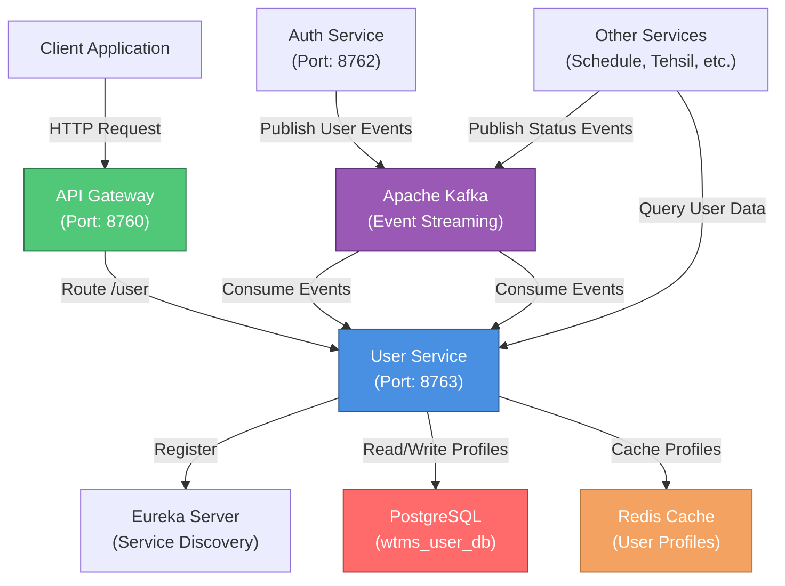
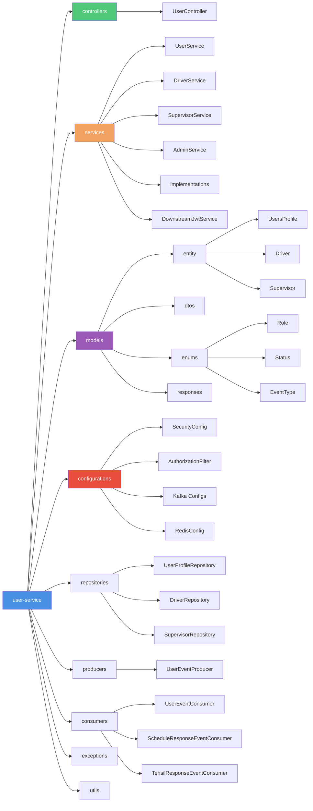
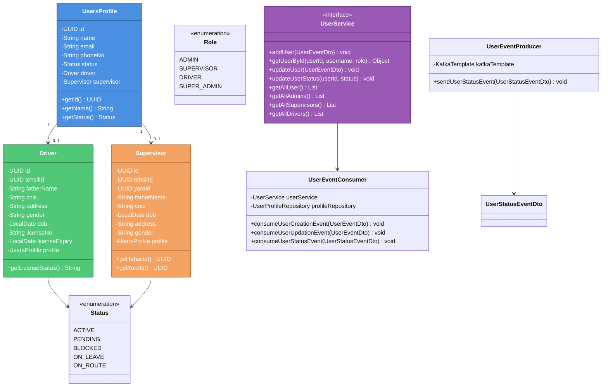

# User Service - WTMS (Waste Transportation Management System)

## Service Overview

The **User Service** is the core user profile and information management microservice within the WTMS ecosystem. It maintains comprehensive user profile data for all system roles (Drivers, Supervisors, and Admins) and provides role-specific information retrieval endpoints.

### Key Responsibilities

- **User Profile Management**: Maintains detailed user profile information (name, email, phone, contact details)
- **Role-Based Profiles**: Manages specialized data for different user roles:
  - **Drivers**: License information, vehicle assignments, tehsil (district) assignments
  - **Supervisors**: Tehsil and yard assignments, administrative hierarchy
  - **Admins**: Administrative user profiles with access management
- **Event-Driven Architecture**: Consumes user creation and update events from the Auth Service via Kafka
- **Data Synchronization**: Listens to events from Schedule Service and Tehsil Service for cross-service consistency
- **User Status Management**: Tracks user status (ACTIVE, PENDING, BLOCKED, ON_LEAVE, ON_ROUTE)
- **Query & Filtering**: Provides comprehensive querying capabilities to retrieve users by role, status, or individual ID
- **API Gateway Integration**: Exposes REST endpoints protected by JWT authentication and role-based access control
- **Performance Optimization**: Leverages Redis caching for frequently accessed user profiles

### Business Context

The User Service acts as the **central repository for user profile data** in WTMS. It synchronizes with the Auth Service (which manages authentication) and consumes events to maintain up-to-date user information. All other microservices query this service to retrieve user details for operations like trip assignment, vehicle tracking, and schedule management.

---

## Architecture & Design

### High-Level Architecture Diagram



### Package Diagram (Internal Structure)



### Class Diagram (Core Domain Model)



---

## Setup & Execution

### Prerequisites

Ensure the following services and tools are installed and running on your machine:

- **Java Development Kit (JDK)**: Version 17 or higher
- **Apache Maven**: Version 3.8.1 or higher
- **PostgreSQL**: Version 13+ (for user profile database storage)
- **Apache Kafka**: Version 3.0+ (for event streaming)
- **Redis**: Version 6.0+ (for profile caching)
- **Eureka Server**: Running on `http://localhost:8761/eureka/` (for service discovery)
- **Auth Service**: Running on port 8762 (publishes user events to Kafka)

### Step 1: Clone the Repository

```bash
git clone <repository-url>
cd BackEnd/user-service
```

### Step 2: Configure Environment Variables

Update `src/main/resources/application.properties` with your environment-specific values:

```properties
# Database Configuration
spring.datasource.url=jdbc:postgresql://localhost:5432/wtms_user_db
spring.datasource.username=admin
spring.datasource.password=your_strong_password

# JWT Configuration (for token validation)
jwt.public-key.path=classpath:certs/public_key.pem
app.security.internal-secret=your_secret_key

# Kafka Configuration
kafka.bootstrap.server=localhost:9092
kafka.consumer.group=user-group

# Redis Configuration
spring.data.redis.host=localhost
spring.data.redis.port=6379
spring.data.redis.database=1

# Eureka Configuration
eureka.client.service-url.defaultZone=http://localhost:8761/eureka/
```

### Step 3: Build the Service

```bash
# Clean and build with Maven
mvn clean install

# Or skip tests for faster build
mvn clean install -DskipTests
```

### Step 4: Run the Service Locally

```bash
# Option 1: Using Maven Spring Boot plugin
mvn spring-boot:run

# Option 2: Run the generated JAR
java -jar target/user-service-0.0.1-SNAPSHOT.jar
```

### Step 5: Verify the Service

Once the service is running, verify its status:

```bash
# Health Check
curl -X GET http://localhost:8763/actuator/health

# Check Eureka Registration
curl -X GET http://localhost:8761/eureka/apps/user-service

# Swagger UI (OpenAPI Documentation)
# Open in browser: http://localhost:8763/swagger-ui.html
```

### Default Port Configuration

| Service | Port | Description |
|---------|------|-------------|
| User Service | `8763` | User Profile Management & Queries |
| Auth Service | `8762` | Authentication & Authorization (Event Producer) |
| Eureka Server | `8761` | Service Discovery |
| Kafka | `9092` | Event Streaming |
| PostgreSQL | `5432` | User Profile Database |
| Redis | `6379` | Cache & Session Storage |

---

## Environment Variables & Application Properties

### Required Configuration Table

| Property | Type | Default | Description | Example |
|----------|------|---------|-------------|---------|
| `spring.application.name` | String | `user-service` | Microservice identifier | `user-service` |
| `server.port` | Integer | `8763` | HTTP server port | `8763` |
| `spring.datasource.url` | String | Required | PostgreSQL connection URL | `jdbc:postgresql://localhost:5432/wtms_user_db` |
| `spring.datasource.username` | String | Required | Database username | `admin` |
| `spring.datasource.password` | String | Required | Database password (strong) | `your_strong_password` |
| `spring.jpa.hibernate.ddl-auto` | String | `update` | Schema generation strategy | `update` / `create` / `validate` |
| `jwt.public-key.path` | String | Required | Path to RSA public key (PEM) | `classpath:certs/public_key.pem` |
| `app.security.internal-secret` | String | Required | Internal API secret key (minimum 32 chars) | `yK8!pL3@xQ7#dT9$wF2^sR5&vM1*bN6(` |
| `kafka.bootstrap.server` | String | Required | Kafka broker address | `localhost:9092` |
| `kafka.consumer.group` | String | `user-group` | Kafka consumer group ID | `user-group` |
| `spring.data.redis.host` | String | Required | Redis server hostname | `localhost` |
| `spring.data.redis.port` | Integer | `6379` | Redis server port | `6379` |
| `spring.data.redis.database` | Integer | `1` | Redis database number | `1` |
| `eureka.client.register-with-eureka` | Boolean | `true` | Register service with Eureka | `true` |
| `eureka.client.service-url.defaultZone` | String | Required | Eureka server URL | `http://localhost:8761/eureka/` |
| `eureka.instance.prefer-ip-address` | Boolean | `true` | Use IP address instead of hostname | `true` |
| `management.tracing.sampling.probability` | Float | `1.0` | Distributed tracing sample rate (0.0-1.0) | `1.0` |
| `logging.level.org.hibernate.SQL` | String | `DEBUG` | Hibernate SQL logging level | `DEBUG` / `INFO` |
| `spring.jpa.show-sql` | Boolean | `false` | Print SQL statements to console | `false` / `true` |

### Kafka Topics Configuration

| Topic | Consumer Group | Purpose |
|-------|----------------|---------|
| `user-created-topic` | `user-group` | New user creation events from Auth Service |
| `user-updated-topic` | `user-group` | User profile update events from Auth Service |
| `user-status-topic` | `user-group` | User status change events |
| `user-response-topic` | External | User Service publishes status updates (produced) |
| `schedule-response-topic` | `user-group` | Schedule Service status events |
| `tehsil-response-topic` | `user-group` | Tehsil Service status events |

---

## API Endpoints

### User Profile Endpoints

| HTTP Method | Endpoint | Role Required | Description | Request Params | Response |
|-------------|----------|---------------|-------------|-----------------|----------|
| `GET` | `/user/profile` | `ADMIN`, `SUPERVISOR`, `DRIVER` | Retrieve current authenticated user's profile | `userId` (header), `username` (header), `role` (header) | `{ "id": "UUID", "name": "string", "email": "string", "phoneNo": "string", "role": "string", "status": "string", "driverDetails": {...}, "supervisorDetails": {...} }` |
| `GET` | `/user/all` | `ADMIN` | Retrieve all users with their profiles | None | `[ { user profile objects } ]` |
| `GET` | `/user/{id}` | `ADMIN` | Retrieve specific user profile by ID | id: UUID path parameter | `{ user profile object }` |
| `GET` | `/user/admins` | `ADMIN` | Retrieve all admin users | None | `[ { admin profile objects } ]` |
| `GET` | `/user/supervisors` | `ADMIN` | Retrieve all supervisor users | None | `[ { supervisor profile objects } ]` |
| `GET` | `/user/drivers` | `ADMIN` | Retrieve all driver users | None | `[ { driver profile objects } ]` |

### Health & Monitoring Endpoints

| HTTP Method | Endpoint | Description | Response |
|-------------|----------|-------------|----------|
| `GET` | `/actuator/health` | Service health status | `{ "status": "UP/DOWN", "components": {...} }` |
| `GET` | `/actuator/metrics` | Application metrics | Micrometer metrics |
| `GET` | `/swagger-ui.html` | OpenAPI (Swagger) documentation | Interactive API documentation |

### Example API Requests

#### Get Current User Profile
```bash
curl -X GET http://localhost:8763/user/profile \
  -H "Authorization: Bearer <jwt_access_token>"
```

#### Get All Users (Admin Only)
```bash
curl -X GET http://localhost:8763/user/all \
  -H "Authorization: Bearer <admin_jwt_token>"
```

#### Get User by ID (Admin Only)
```bash
curl -X GET http://localhost:8763/user/550e8400-e29b-41d4-a716-446655440000 \
  -H "Authorization: Bearer <admin_jwt_token>"
```

#### Get All Drivers (Admin Only)
```bash
curl -X GET http://localhost:8763/user/drivers \
  -H "Authorization: Bearer <admin_jwt_token>"
```

#### Get All Supervisors (Admin Only)
```bash
curl -X GET http://localhost:8763/user/supervisors \
  -H "Authorization: Bearer <admin_jwt_token>"
```

---

## Test Cases & Documentation

### Core Test Scenarios

| Scenario ID | Category | Scenario Description | Input Parameters | Expected Output | Validation Type |
|-------------|----------|----------------------|-------------------|------------------|-----------------|
| **USER-TC-001** | Event Consumption | User creation event consumed and profile stored | UserEventDto with all driver/supervisor fields | Profile created in DB, HTTP 200, event logged | Integration Test |
| **USER-TC-002** | Event Consumption | User update event consumed and profile modified | UserEventDto with updated fields (email, phone) | Profile updated in DB, HTTP 200, event logged | Integration Test |
| **USER-TC-003** | Event Consumption | User status change event processed | UserStatusEventDto with status = BLOCKED | User status updated, event published to response topic | Integration Test |
| **USER-TC-004** | Profile Retrieval | Authenticated user retrieves own profile | Authenticated request to `/user/profile` | HTTP 200, user's complete profile returned with role-specific details | Integration Test |
| **USER-TC-005** | Profile Retrieval | Driver user retrieves own profile | Driver JWT token, request to `/user/profile` | HTTP 200, profile with driverDetails (license, cnic, tehsil) | Integration Test |
| **USER-TC-006** | Profile Retrieval | Supervisor user retrieves own profile | Supervisor JWT token, request to `/user/profile` | HTTP 200, profile with supervisorDetails (yard, tehsil) | Integration Test |
| **USER-TC-007** | Profile Retrieval | Admin user retrieves all users | Admin JWT token, request to `/user/all` | HTTP 200, list of all user profiles | Integration Test |
| **USER-TC-008** | Profile Retrieval | Admin retrieves user by specific ID | Admin JWT token, GET `/user/{valid-uuid}` | HTTP 200, specific user profile returned | Integration Test |
| **USER-TC-009** | Profile Retrieval | Admin retrieves all drivers | Admin JWT token, request to `/user/drivers` | HTTP 200, list of all driver profiles with license info | Integration Test |
| **USER-TC-010** | Profile Retrieval | Admin retrieves all supervisors | Admin JWT token, request to `/user/supervisors` | HTTP 200, list of all supervisor profiles with yard assignments | Integration Test |
| **USER-TC-011** | Profile Retrieval | Admin retrieves all admins | Admin JWT token, request to `/user/admins` | HTTP 200, list of all admin profiles | Integration Test |
| **USER-TC-012** | Authorization | Non-admin retrieves `/user/all` endpoint | Driver/Supervisor JWT token, request to `/user/all` | HTTP 403 Forbidden, "Access denied" | Unit Test |
| **USER-TC-013** | Authorization | Unauthenticated request to protected endpoint | No Authorization header, request to `/user/profile` | HTTP 401 Unauthorized | Unit Test |
| **USER-TC-014** | Authorization | Invalid JWT token used | Invalid/expired JWT token, request to `/user/profile` | HTTP 401 Unauthorized, "Invalid token" | Unit Test |
| **USER-TC-015** | Data Consistency | Driver profile updated with license expiry event | Schedule event consumed with license expiry date | Driver profile updated, license status marked as EXPIRED | Integration Test |
| **USER-TC-016** | Data Consistency | Supervisor tehsil assignment updated from event | Tehsil event consumed with new tehsil assignment | Supervisor profile updated with new tehsilId | Integration Test |
| **USER-TC-017** | Caching | User profile cached in Redis after first retrieval | First request to `/user/{id}` | Profile retrieved, cached in Redis with TTL | Integration Test |
| **USER-TC-018** | Caching | Cached profile used for subsequent requests | Second request to same `/user/{id}` within cache TTL | Profile retrieved from Redis (no DB query) | Integration Test |
| **USER-TC-019** | Error Handling | Retrieve non-existent user by ID | Admin JWT token, GET `/user/{invalid-uuid}` | HTTP 404 Not Found, "User not found" | Integration Test |
| **USER-TC-020** | Error Handling | Database connection failure during retrieval | Simulate DB outage, request to `/user/all` | HTTP 500 Internal Server Error with error response | Integration Test |
| **USER-TC-021** | Data Validation | Driver profile without required field (licenseNo) | UserEventDto missing licenseNo | HTTP 400 Bad Request (if validated), profile not created | Unit Test |
| **USER-TC-022** | Data Validation | User profile with invalid email format | UserEventDto with email = "invalid-email" | Profile creation failed, error logged | Unit Test |
| **USER-TC-023** | Status Transitions | User status ACTIVE -> ON_LEAVE -> ACTIVE | UserStatusEventDto with status transitions | Each transition reflected in DB, timestamps logged | Integration Test |
| **USER-TC-024** | Status Transitions | User status ACTIVE -> BLOCKED | UserStatusEventDto with status = BLOCKED | User blocked, future authentication attempts denied by Auth Service | Integration Test |
| **USER-TC-025** | Event Publishing | User status change event published to response topic | User profile updated, status event triggered | Event published to `user-response-topic` with metadata | Integration Test |

### Running Tests

```bash
# Run all tests
mvn test

# Run specific test class
mvn test -Dtest=UserServiceApplicationTests

# Run tests with coverage
mvn clean test jacoco:report

# View coverage report
# Open target/site/jacoco/index.html in browser
```

### Test Dependencies

The project includes the following testing frameworks:

```xml
<dependency>
    <groupId>org.springframework.boot</groupId>
    <artifactId>spring-boot-starter-test</artifactId>
    <scope>test</scope>
</dependency>
<dependency>
    <groupId>org.springframework.kafka</groupId>
    <artifactId>spring-kafka-test</artifactId>
    <scope>test</scope>
</dependency>
```

---

## Key Components & Their Roles

### Security & Authorization

- **AuthorizationFilter**: Intercepts HTTP requests, validates JWT tokens, extracts claims (userId, username, role) and populates request headers
- **SecurityConfig**: Configures Spring Security, enables method-level authorization, and permits public endpoints (Swagger, health)
- **DownstreamJwtService**: Validates JWT tokens and extracts user claims from Auth Service's JWT

### Data Persistence

- **UsersProfile Entity**: Core user profile entity with basic information (name, email, phone, status)
- **Driver Entity**: Driver-specific data including license, CNIC, DOB, tehsil assignment (one-to-one with UsersProfile)
- **Supervisor Entity**: Supervisor-specific data including tehsil and yard assignments (one-to-one with UsersProfile)
- **Repositories**: Spring Data JPA repositories for querying user profiles, drivers, and supervisors

### Business Logic

- **UserService**: Interface defining user profile operations
- **UserServiceImpl**: Core user service implementation for CRUD operations
- **DriverService**: Specialized service for driver-specific operations
- **SupervisorService**: Specialized service for supervisor-specific operations
- **AdminService**: Admin-specific profile operations

### Event Streaming

- **UserEventConsumer**: Listens to Kafka topics for user events (creation, updates, status changes)
  - `user-created-topic`: Consumes new user events from Auth Service
  - `user-updated-topic`: Consumes user update events from Auth Service
  - `user-status-topic`: Consumes user status change events
  - `schedule-response-topic`: Consumes schedule-related events
  - `tehsil-response-topic`: Consumes tehsil assignment events
- **UserEventProducer**: Publishes user status events to `user-response-topic` for other services to consume

### Caching & Performance

- **RedisConfig**: Configures Spring Data Redis for user profile caching
- **Profile Caching**: Frequently accessed profiles cached in Redis (database index 1) to reduce DB queries
- **Cache Invalidation**: Automatic cache invalidation on profile updates

---

## Kafka Topics & Event Flow

### Consumed Topics

```
┌─────────────────────────────────────────────────────────────┐
│                      CONSUMED TOPICS                        │
└─────────────────────────────────────────────────────────────┘

1. user-created-topic
   ├─ Published by: Auth Service
   ├─ Consumer Group: user-group
   └─ Payload: UserEventDto (userId, username, role, personal details)
      └─ Action: Create new user profile + role-specific data

2. user-updated-topic
   ├─ Published by: Auth Service
   ├─ Consumer Group: user-group
   └─ Payload: UserEventDto (updated fields)
      └─ Action: Update user profile

3. user-status-topic
   ├─ Published by: Auth Service / Other Services
   ├─ Consumer Group: user-group
   └─ Payload: UserStatusEventDto (userId, newStatus)
      └─ Action: Update user status (ACTIVE, BLOCKED, ON_LEAVE, etc.)

4. schedule-response-topic
   ├─ Published by: Schedule Service
   ├─ Consumer Group: user-group
   └─ Payload: ScheduleResponseEventDto
      └─ Action: Update driver schedule/license expiry data

5. tehsil-response-topic
   ├─ Published by: Tehsil Service
   ├─ Consumer Group: user-group
   └─ Payload: TehsilResponseEventDto
      └─ Action: Update supervisor tehsil/yard assignments
```

### Produced Topics

```
┌─────────────────────────────────────────────────────────────┐
│                     PRODUCED TOPICS                         │
└─────────────────────────────────────────────────────────────┘

1. user-response-topic
   ├─ Published by: User Service
   ├─ Payload: UserStatusEventDto (complete user data + status)
   └─ Consumed by: Other Services (Trip, Fleet, Tracking)
      └─ Use Case: Notify other services about user status changes
```

---

## Monitoring & Observability

### Actuator Endpoints

The service exposes the following monitoring endpoints via Spring Boot Actuator:

```bash
# Health check
curl http://localhost:8763/actuator/health

# Application metrics
curl http://localhost:8763/actuator/metrics

# Trace recent requests (if enabled)
curl http://localhost:8763/actuator/httptrace
```

### Logging Configuration

Logs are configured using Log4j2 (high-performance asynchronous logging):

- **Log File**: `logs/user-service.log`
- **Log Level**: Configurable per package
- **Async Appender**: Uses Disruptor for high-throughput logging without blocking

### Distributed Tracing

- **Micrometer Tracing**: Enabled with Brave bridge for distributed tracing
- **Trace ID Propagation**: 100% sampling enabled (`management.tracing.sampling.probability=1.0`)
- **Integration**: Compatible with ELK Stack, Jaeger, or Zipkin

---

## Common Issues & Troubleshooting

### Issue 1: Service Cannot Connect to PostgreSQL

**Symptoms**: `SQLException: Unable to connect to database`

**Solutions**:
```bash
# Verify PostgreSQL is running
psql -U admin -d wtms_user_db

# Check connection string in application.properties
# Ensure credentials are correct
# Verify firewall allows port 5432
```

### Issue 2: Kafka Events Not Being Consumed

**Symptoms**: User profiles not being created when Auth Service publishes events

**Solutions**:
```bash
# Verify Kafka broker is running
jps | grep Kafka

# Check bootstrap server address matches
# Verify consumer group: user-group exists
kafka-consumer-groups.sh --list --bootstrap-server localhost:9092

# Check if topics exist
kafka-topics.sh --list --bootstrap-server localhost:9092
```

### Issue 3: Service Not Registering with Eureka

**Symptoms**: Service not visible in Eureka dashboard

**Solutions**:
```bash
# Verify Eureka server is running on port 8761
curl http://localhost:8761/eureka/apps

# Check application.properties for Eureka URL
# Ensure service name is unique
# Check network connectivity to Eureka server
```

### Issue 4: JWT Token Validation Fails

**Symptoms**: `Invalid token` or `JWT signature does not match`

**Solutions**:
```bash
# Verify JWT public key path is correct
# Check if public_key.pem exists at classpath:certs/public_key.pem
# Ensure public key matches private key from Auth Service
```

### Issue 5: Redis Connection Error

**Symptoms**: `Cannot get Redis connection`

**Solutions**:
```bash
# Verify Redis is running
redis-cli ping  # Should return PONG

# Check Redis connection string
# Default port: 6379, database: 1
# Ensure no password requirement (or configure password)
```

### Issue 6: Unauthorized Access (403 Forbidden)

**Symptoms**: Non-admin users getting 403 on `/user/all` endpoint

**Solutions**:
```bash
# Verify JWT token has ADMIN or SUPER_ADMIN role
# Check JWT claims extraction in AuthorizationFilter
# Verify method security annotations are correct
```

---

## Deployment & Production Checklist

- [ ] Change default passwords in `application.properties`
- [ ] Configure external PostgreSQL instance (non-localhost)
- [ ] Configure external Kafka cluster with replication
- [ ] Configure Redis with persistence and replication
- [ ] Enable HTTPS/TLS for all endpoints
- [ ] Configure CORS policies for API Gateway
- [ ] Set up distributed tracing (Jaeger/Zipkin)
- [ ] Enable centralized logging (ELK Stack)
- [ ] Configure health check and alerting
- [ ] Document custom environment variables
- [ ] Set up CI/CD pipeline with automated tests
- [ ] Review and harden Spring Security configurations
- [ ] Implement rate limiting and DDoS protection
- [ ] Regular security audits and dependency updates
- [ ] Load test with concurrent user queries
- [ ] Monitor Redis memory usage for cache optimization

---

## Additional Resources

- **Spring Boot Documentation**: https://spring.io/projects/spring-boot
- **Spring Security**: https://spring.io/projects/spring-security
- **Spring Cloud Netflix Eureka**: https://spring.io/projects/spring-cloud-netflix
- **Kafka Documentation**: https://kafka.apache.org/documentation/
- **Redis Documentation**: https://redis.io/documentation
- **Micrometer Docs**: https://micrometer.io/docs
- **OpenAPI/Swagger**: `/swagger-ui.html`

---

## Contributing & Support

For issues, questions, or contributions:

1. Review the [HELP.md](./HELP.md) file for additional setup guidance
2. Check the inline code comments for implementation details
3. Refer to the Spring Boot logs (`logs/` directory) for debugging
4. Contact the WTMS development team for support

---

**Last Updated**: June 22, 2026  
**Service Version**: 0.0.1-SNAPSHOT  
**Java Version**: 17  
**Spring Boot Version**: 4.0.6
